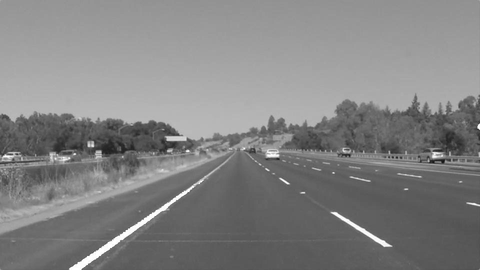
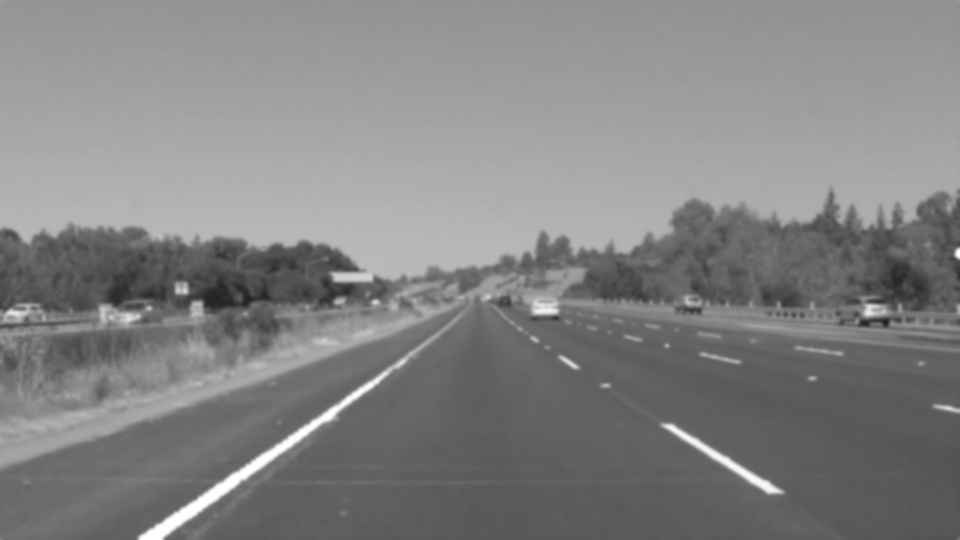
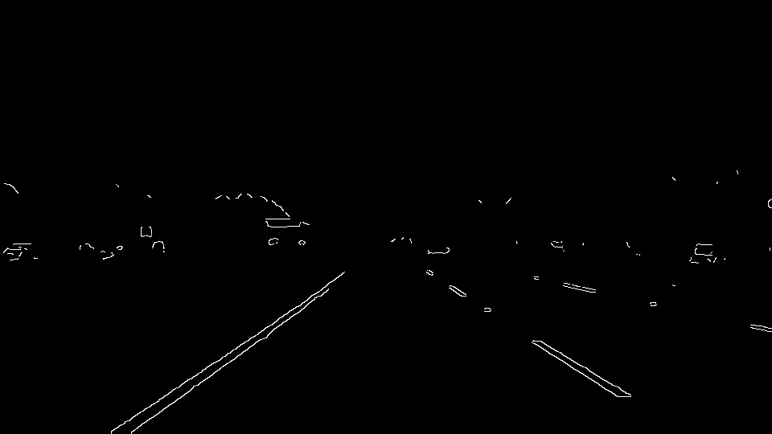
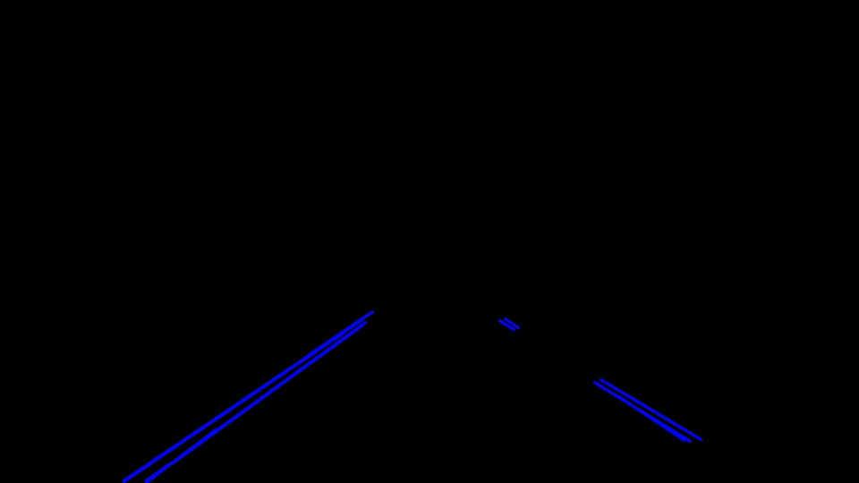
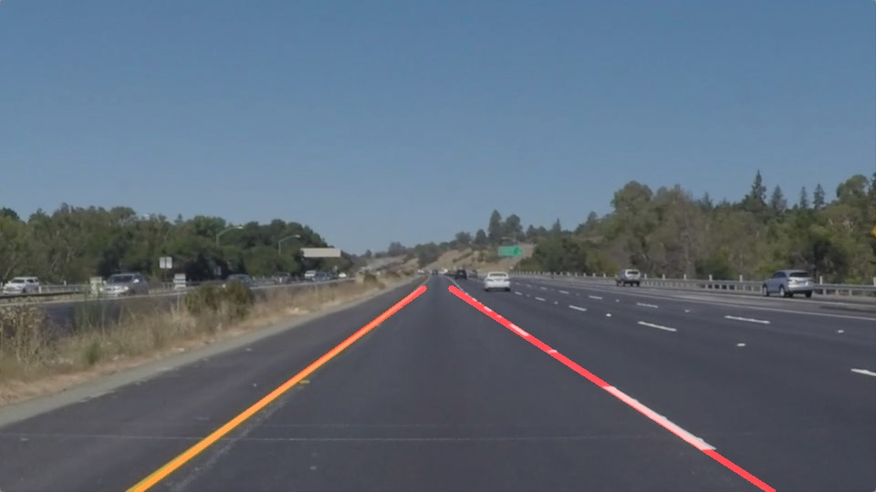

# **Finding Lane Lines on the Road** 

### My Pipeline

My final pipeline consists of 6 steps:
1. highlight yellow lanes
2. convert to grayscale
3. blurry with gaussian
4. apply edge filter
5. crop the image to relevant region of interest
6. detect lines with the hough transformation
7. identify two lanes by extrapolating the lines
#### Highlight Yellow Lanes

Because some lanes are yellow instead of yellow, they are harder to detect than white ones because the difference between gray and yellow is not too big. Therefore, we detect yellow parts of the image beforehand and then paint those pixels white.

I achieved this by converting the image to the hsv color space and checking for pixels in range of yellow using `cv2.inRange`.

Example output:
![hightlight_yellow_lanes][writeup_images/img_yellow.jpg]

#### Convert to Grayscale and Blurry with Gaussian and Apply Edge Filter

For this step I converted the image with the given helper function and then applied a gaussian filter with kernel size `7`. 
The canny filter to detect edges was applied with a low threshold of `200` and a high threshold of `240`.

Example output:

#### Crop the Image to Relevant Region of Interest 

I then cropped the image with a trapez or pyramid similar shape that
- only consideres the lower half of the image
- the tip goes to 5/11 of the width of the image 

Example output:

#### Detect Lines with the Hough Transformation

The hough lines are found with
- `rho` of `2`
- `theta` of 1 degree `pi/180`
- a threshold of `50`
- a minimum line length of `10px`
- a maximum line gap of `20px`

Example output:

#### Identify two Lanes by Extrapolating the Lines

Two identify two final lines with the output of the hough line detection, these are the steps I did:

- for every line I'm calculating the slopes and intercepts or every detected line
- then, by sorting for the slopes and detecting gaps in either slopes or intercepts, I am grouping detected lines to possible lanes
- I am then calculating the average slope and intercept of the grouped lines
- from the grouped lines, I am picking the innermost two lanes that have a negative and positive lane with the assumpting the because of the camera view the right (left) lane has to have a positive (negative) slope

Example output:

### Potential Shortcomings

- As the pipeline is only checking straight lanes, it might be vulnerable to very curvy lanes.
- Another vulnerability is the highlighting of yellow lanes. If a yellow car is in sight, this might lead to weird detections.
- The grouping of lines to potential lanes is also still very naive and wrongly detected lines could lead to wrong extrapolated detected lanes.

### Possible Improvements

- Using sequences of images: When processing videos, every frame is processed individually. We could improve stability by taking the detected lines of earlier and later frames into account. If the lines are fairly similar, our confidence in the deteced lane increases.
- Detecting curves: Instead of only considering straight lines, detecting curves might be more appropriate for lane detection
- Rating detected lines: Currently, every line detected in the hough transformation is considered the same. I would prefer to take into accoung the length of a detected line (the longer, the more confident we are it is really a lane) or how many lines are grouped to a lane (a dashed line with three suitable line segments should be considered more than a single, short line)